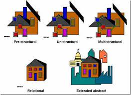
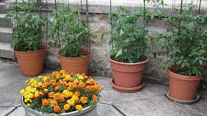
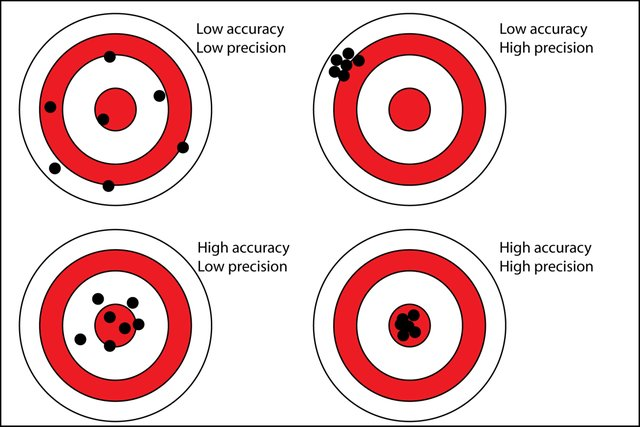

```{r xaringan-themer, include=FALSE, warning=FALSE}
library(xaringanthemer)
style_duo_accent(
  primary_color = "#081d58",
  secondary_color = "#FF961C",
 inverse_header_color = "#FFFFFF",
 title_slide_text_color = "#edf8b1",
 link_color =  "#41b6c4"
)
#style_solarized_light(text_font_google   = google_font("Josefin Sans", "400", "400i", "800i", "800"))
#style_mono_light(
#  base_color = "#1c5253",
#  header_font_google = google_font("Josefin Sans"),
#  text_font_google   = google_font("Josefin Sans", "400", "400i", "800i", "800"),
#  code_font_google   = google_font("Fira Mono")
#)
```

<style>

.center2 {
  margin: 0;
  position: absolute;
  top: 50%;
  left: 50%;
  -ms-transform: translate(-50%, -50%);
  transform: translate(-50%, -50%);
}

</style>

<style type="text/css">
.remark-slide-content {
    font-size: 30px;
}
</style>
```{r setup, include=FALSE}
options(htmltools.dir.version = FALSE)
```

## Lecturer-in-charge and Chief Examiner

- Dr Thiyanga S. Talagala

- PhD in Statistics (2019), Monash University, Australia

- BSc (Hons, Special) Statistics, University of Sri Jayewardenepura

- Batch first and Professor R A Dayananda Gold Medalist

- Research interests

  - Data visualization, Computer vision, Time series forecasting, Machine learning and interpretability methods, Statistical computing

- Personal website: https://thiyanga.netlify.app/

---

## Personal website

```{r, echo=FALSE}
knitr::include_url("https://thiyanga.netlify.app/")
```

https://thiyanga.netlify.app/

---

## Course website

```{r, echo=FALSE}
knitr::include_url("https://smart-doe.netlify.app/")
```

https://smart-doe.netlify.app/


---

## Course outline


```{r, echo=FALSE}
knitr::include_url("https://smart-doe.netlify.app/DOE_ILO_PLO.pdf")
```

---

## Makeup Quiz

Category A

- An illness that requires the student to miss all of his or her classes for 2 days or more.

Category B

- A period of grief for loss of a family member or friend.

Category C

- A family emergency.

---

## Philosophy driving our makeup exam policy has three goals


- Keep things fair.

- Encourage good time-management.

- Encouragement and appreciation of on time submission students.


**A valid documentation of proof is required prior to the assignment deadline.**

---

## Help us to help you!

.pull-left[

]

--

.pull-right[

- Use the LMS forum to ask questions.

- Feel free to answer each others questions.

- I will also provide answers.

- Email ttalagala@sjp.ac.lk only for issues that are personal.

- For details on consultation see course website.


]


---
class: inverse, center, middle

# Additional resources

---

## R Ladies 


---

## R Ladies 

```{r, echo=FALSE}
knitr::include_url("https://rladies.org/")
```

---

## R Ladies Colombo

```{r, echo=FALSE}
knitr::include_url("https://rladiescolombo.netlify.app/")
```

---

## Other

- Stack Overflow: question and answer website for professional and enthusiast programmers

- Cousera

- DataCamp

- Udemy etc.

---
class: inverse, center, middle

# Buckle up - Let's get started.


---

# Why Design and Analysis of Experiments ?

- Design

- Analysis

- Experiments

**Example:**

1. A corn field is divided into 4 parts, each part is **treated** with a different fertilizer to see which produces the most corn.

2. An experiment is conducted to study the influence of operating temperature and three types of face-plate glass in the light output of an oscilloscope tube.


---
background-image: url('stat1.png')
background-position: center
background-size: cover

---
background-image: url('stat2.png')
background-position: center
background-size: cover

---
background-image: url('stat3.png')
background-position: center
background-size: cover

---
background-image: url('stat4.png')
background-position: center
background-size: cover

---
class: center, middle
# Research designs

---

## 1. Observational Studies

- Observe the subjects and measure variables based on what is seen and heard without interfere the subjects or variables in any way.

- Reports the **association**

--

## 2. Exerimental studies

-  Purposeful changes are made to the input variables of a process or system and then observes what happens in the output response.

- The researcher intervenes to change the process

- The goal is to determine what **effect** a particular treatment has on the outcome.
---

# Example: Observational study


> Do you favor increasing gas price?

**Goal:**

Get information on the opinion of the people in Greater Colombo areas.

**Research design:**

In Greater Colombo areas, the people with registered
phone number were called for a telephone survey.


---

# Example: Experimental study.

A nutritionist is interested in comparing the effect of two types of preservatives (A and B) on the lifespan of white flour bread (the time that elapses from the moment the bread is made until the bread raises mold). In order to perform the experiment, the researcher chooses 20 bread flour mixtures and randomly divided them into two groups. One group received preservative A and the other received preservative B. After that the researcher measured the time that elapses from the moment the bread is made until the bread raises mold.


---
## History of Design of Experiments

.pull-left[

Ronald Aylmer Fisher, who always published as R. A. Fisher, radically changed the use of statistics in research. He invented the technique called Analysis of Variance and founded the entire modern field called Design of Experiments.

]

.pull-right[


]

---
class: class, middle, center

## Your Turn

Determine whether each research study is an **observational study** or **experimental study**.

---
## Question 1

**Depression, anxiety, and stress among Sri Lankan undergraduates in times of Covid-19 lockdown**

For the purpose of data collection, an online cross-sectional survey was carried out from May 26 to June 27, 2020, utilizing a Google adapted preformed questionnaire. The form was shared with a short overview and justification through Facebook, Twitter, Facebook messenger, Viber, and What’s App. 

```{r, echo=FALSE}
library(countdown)
countdown(minutes = 2L, seconds = 00)
```


---
## Question 2

**Gaming behavior of school children following Covid-19 lockdown.**

Goal: Compare gaming habits before and after the pandemic.

Data collection method: Online questionnaire, shared via social media and youth network


```{r, echo=FALSE}
library(countdown)
countdown(minutes = 2L, seconds = 00)
```

---

## Question 3

Does the color of a basket ball influence the number of goals?

A random group of students is chosen and asked them to do a series of 5 shoots using a regulation normal-coloredbasket ball. The data is recorded. The same group is then given a green colored basketball and the number of shoots is performed. The data is again recorded. A statistical analysis is performed.

```{r, echo=FALSE}
library(countdown)
countdown(minutes = 2L, seconds = 00)
```


---

class: middle, center

# Design of Experiments: Terminologies


---

## Factor


- A factor is an independent variable or assignable cause that may affect the responses and of which different levels are included in the experiment. 

- Also known as explanatory variables, predictor
variables, or input variables.

## Factor level

- The values that the factor take 

---

## Example

An investigation was carried out to determine the effect of two types of fertilizer (A, B) and water-level (20ml, 40ml, 60ml) on the nitrogen content of leaves.

### Factors:

Fertilizer type

Water-level

### Factor-levels:

Fertilizer type: **A, B**

Water-level: **20, 40, 60**

---

## Treatment

Combinations of factor levels are called treatments.

Fertilizer type: **A, B**

Water-level: **20, 40, 60**

**Treatments**

A-20, A-40, A-60

B-20, B-40, B-60

---

## Single factor study

A treatment corresponds to a factor level, thus the number of treatments equals the number of different factor levels of that factor

## Multi-factor study

A treatment corresponds to a combination of factor levels across different factors, thus the number of all possible treatments is the product of the number of factors levels of different factors. 

.content-box-yellow[The goal of an experiment is to detect differences between treatments.]

---


## Experimental unit

- The smallest unit of experimental material to which a treatment can be assigned.


## Observational unit (Sampling unit)

- The smallest unit which the response will be measured on.

- This may not be the same as the experimental unit.

**The observational unit is smaller than the experimental unit.**

**Each experimental unit consists of several observational units.**


---


## Example



A-20, A-40, A-60 B-20, B-40, B-60

Measure nitrogen content from multiple leaves and use mean nitrogen content to represent the individual plant.

Experimental unit: Pot (Individual plant)

Observation unit: Leaves

---
class: middle, center

# Your Turn

What is the experimental unit?

What is the observational unit?

---

## Question 4

20 rats are randomly assigned to each of 4 doses (none, low, medium, high). The rats are kepts in individual cages under the same environmental conditions in the same room. Each rat has its assigned dose stirred into its daily meal for 2 weeks. The weight of each rat is recorded after two weeks. 

- What is the experimental unit?

- What is the observational unit?

```{r, echo=FALSE}
library(countdown)
countdown(minutes = 4L, seconds = 00)
```

---

## Question 5

20 rats are randomly assigned to 4 cages (5 rats in each). Each cage is then randomly assigned to one dose (non, low, medium, high). The rats are kept in their assigned cages under the same environmental conditions in the same room. Rats are not fed individually; food is placed in each cage in a common plate out of which all rats eat. The weight of each rat is recorded after two weeks. 

- What is the experimental unit?

- What is the observational unit?

```{r, echo=FALSE}
library(countdown)
countdown(minutes = 4L, seconds = 00)
```

---

## What is Design of Experiments?

"Design of experiments (DOE) is a statistical approach to designing and conducting
experiments such that the experiment provides the most efficient and economical
methods of determining **the effect of a set of independent variables on a response
variable**."

Source: The Certified Six Sigma Black Belt Handbook by T. M. Kubiak and Donald W. Benbow

---
class: middle, center

# General Model for Process or System

---
background-image: url('process.png')
background-position: center
background-size: contain


---

## General Model for Process or System

An experiment is a test or series of tests in which purposeful changes are made to input variables of a process or system so that we may observe and identify the reason for the change in output response.

We have controlled input factors $X$’s, output $Y$ and uncontrolled factors $Z$’s.


---

## Inputs (Factors)

- Controllable factors ( $X$ ): measured and determined by scientist

- Uncontrollable factors ( $Z$ ): measured but not determined 
by scientist

- Noise factors ( $\epsilon$ ): unmeasured, uncontrolled factors, often called experimental
variability


---

### Example

An investigatornwants to find the settings that will produce the best surface finish. He can control the feed, speed, and coolant temperature.

Feed: 0.01 and 0.03 inches/ revolution

Speed: 500 and 100 revolutions/ minute

Coolant temperature: 100F, 110F

**Other factors that may influence the response**

Room temperature (Uncontrollable but observable)

Humidity of the room (Uncontrollable but observable)

**Noise factors**: Operator's performance

---

## Objectives of experimental studies

- To determine which variables are the most influential on the response $Y$

- To determine where to set the influential $X$'s so that $Y$ is almost always near the desired value

- To determine where to set the influential $X$'s
 so that the variablity in $Y$ is small
 
- To determine where to set the influential $X$'s so that the effect of the uncontrollable variables (Z's) are minimized
 
 Source,: Design and Analysis of Experiments, Douglas C. Montgomery
 
---

## Ingredients of an experimental design

- Statement of the problem

- Choose a response/output variable

- Determine potential sources of variation in response: factors of interest, nuisance factors

- Choice of factors, levels and ranges

- Choose a set of experimental units

- Experimental design: Decide on the experimental procedure and how treatments are to be
randomly assigned.

- Sample size, number of replications

---

## Other

- Timeline

- Budget

- Technology

- Ethics

---

## Design of Experiments: Steps

1. Gather experimental data

2. Analyze the results

3. Interpret and communicate

---

## Experiments

- **Absolute experiments:** determining the absolute value of some
characteristics 

    Example:

    Average metal strength


- **Comparative experiments:** compare the effect of two or more
factors on some population characteristics.

    Example:

    comparison of different fertilizers, different drugs, different varieties of a crop etc.

---
## Types and Sources of Experimental Errors

1. Random errors

2. Systematic errors

---
## Accuracy vs Precision

.pull-left[



]

.pull-right[
- **Accuracy**: closeness of the measurements to a specific value

- **Precision**: closeness of the measurements to each other 

]
---

## Random error

- The random variation present in all experimental results.

- Different experimental units will give different responses to the
same treatment, and it is often true that applying the same treatment
over and over again to the same unit will result in different responses
in different trials. 

- Random errors are errors that affect the precision of a measurement

- Random error does not refer to conducting the wrong experiment.


---

## Systematic errors

- Systematic errors are due to identified causes 

- Systematic errors are errors that affect the accuracy of a measurement.

Example:

Responses to treatment 1 are measured with instrument A, and responses for treatment 2 are
measured with instrument B.

--


We don’t know if any observed differences
are due to treatment effects or instrument miscalibrations.

---

## Basic principles of experimental design

- Replication

- Randomization

- Blocking


