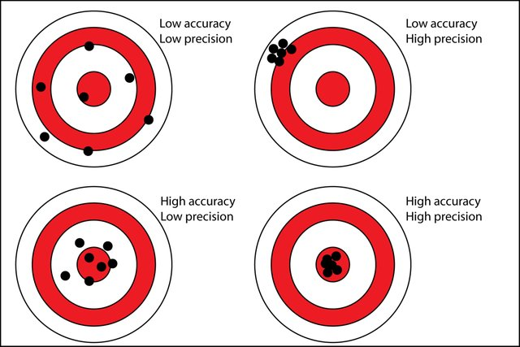

```{r xaringan-themer, include=FALSE, warning=FALSE}
library(xaringanthemer)
style_duo_accent(
  primary_color = "#081d58",
  secondary_color = "#FF961C",
 inverse_header_color = "#FFFFFF",
 title_slide_text_color = "#edf8b1",
 link_color =  "#41b6c4"
)
#style_solarized_light(text_font_google   = google_font("Josefin Sans", "400", "400i", "800i", "800"))
#style_mono_light(
#  base_color = "#1c5253",
#  header_font_google = google_font("Josefin Sans"),
#  text_font_google   = google_font("Josefin Sans", "400", "400i", "800i", "800"),
#  code_font_google   = google_font("Fira Mono")
#)
```

<style>

.center2 {
  margin: 0;
  position: absolute;
  top: 50%;
  left: 50%;
  -ms-transform: translate(-50%, -50%);
  transform: translate(-50%, -50%);
}

</style>

<style type="text/css">
.remark-slide-content {
    font-size: 30px;
}
</style>
```{r setup, include=FALSE}
options(htmltools.dir.version = FALSE)
```


## General model of a process or system 

(Adapted from Montgomery, 2013)

---
background-image: url('process.png')
background-position: center
background-size: contain


---
background-image: url('input.png')
background-position: center
background-size: contain

---
background-image: url('input2.png')
background-position: center
background-size: contain

---

## Nuisance factors


- Nuisance factors are those that may affect the measured result, but are not of primary interest.


---

## **Statistical** design of experiments

The process of planning the experiment so that appropriate data that can be analyzed by statistical methods will be collected, resulting in valid and objective conclusions.

--

Two aspects of any experimental problem

1. The design of the experiment

2. The statistical analysis of data


---

## Basic principles of experimental design

- Replication

- Randomization

- Blocking


---

## Replication

Repetition of the same experiment

## Replicate

Each repition of the experiment is called **replication**.

Example:

A coconut farmer puts two fertilizers (A and B) to 18 plants and each fertilizer is given to nine plants. Then he has 9 replicated from each type of fertilizer.

---

## In-class 

.pull-left[

$y_A$ vs $y_b$


]

.pull-right[

$\bar{y}_A$ vs $\bar{y}_b$

]

---

## Replication (cont.)

1. Estimate experimental error. This is the primary unit of measurement for determining whether observed differences in the data are statistically significant.

2. If the sample mean ($\bar{Y}$) is used to estimate the effect of factors, replication allows the experimenter to obtain a more **precise** estimate of the effect.


(When the standard error is small, sample estimates are more precise; when the standard error is large, sample estimates are less precise.)

---

## Accuracy vs Precision




---

**Distrinction between Replication and Repeated measurements**


Replication: entire experiment is performed more than once for a given set of independent variables. 

Repeated measurements: multiple measurements from the same experimental unit

--

**Example 1: Crystal Growth Experiment**

Independent Variable:  temperature of solutions (degrees fahrenheit)

Response variable: Crystal volume is measured three times.

--

In this case the observed variability in the three repeated measurements is a direct reflection of the inherent variability in the measurement instrument. 

---

## Your turn: Replication or not?

**Example 2: Crystal Growth Experiment**

Independent Variable:  temperature of solutions (degrees fahrenheit)

Response variable: Crystal volume is measured three times.

Four crystals are processed simultaneously form an substance and measurement is taken from each crystal.


```{r, echo=FALSE}
library(countdown)
countdown(minutes = 2L, seconds = 00)
```

---

## Randomization

- both the allocation of **experimental material** and the **order in which the individual runs or trials of the experiment are to be performed** are randomly determined.

- helps to average out the effects of extraneous factors that may be present.

- assign treatments to experimental units so that each unit has an equal chance of being asigned a particular treatment, thus minimizing the effect of variation from uncontrolled noise factors.

---

## Example

Question: Is one fertilizer better than another, in terms of yield?

Outcome variable: Tomato yield.

Factor of interest: Fertilizer type, A or B. One factor having two levels.

Experimental material: One plot of land to be divided into 2 rows of 6
subplots each.

Potential sources of variation: Fertilizer, soil, sun, water, humidity, etc.

---

## How should we assign treatments to the plots?

<style type="text/css">
.tg  {border-collapse:collapse;border-spacing:0;}
.tg td{border-color:black;border-style:solid;border-width:1px;font-family:Arial, sans-serif;font-size:14px;
  overflow:hidden;padding:50px 50px;word-break:normal;}
.tg th{border-color:black;border-style:solid;border-width:1px;font-family:Arial, sans-serif;font-size:14px;
  font-weight:normal;overflow:hidden;padding:50px 50px;word-break:normal;}
.tg .tg-0pky{border-color:inherit;text-align:left;vertical-align:top}
</style>
<table class="tg">
<thead>
  <tr>
    <th class="tg-0pky"></th>
    <th class="tg-0pky"></th>
    <th class="tg-0pky"></th>
    <th class="tg-0pky"></th>
    <th class="tg-0pky"></th>
    <th class="tg-0pky"></th>
  </tr>
</thead>
<tbody>
  <tr>
    <td class="tg-0pky"></td>
    <td class="tg-0pky"></td>
    <td class="tg-0pky"></td>
    <td class="tg-0pky"></td>
    <td class="tg-0pky"></td>
    <td class="tg-0pky"></td>
  </tr>
</tbody>
</table>


---

## Blocking

- Blocking is a technique for dealing with controllable nuisance factors.

- A nuisance factor has some effect on the response, but it is of no interest to the experimenter. However, the variability it transmits to the response needs to be minimized.

---

background-image: url('tea.jpeg')
background-position: center
background-size: cover

## Example: Blocking


