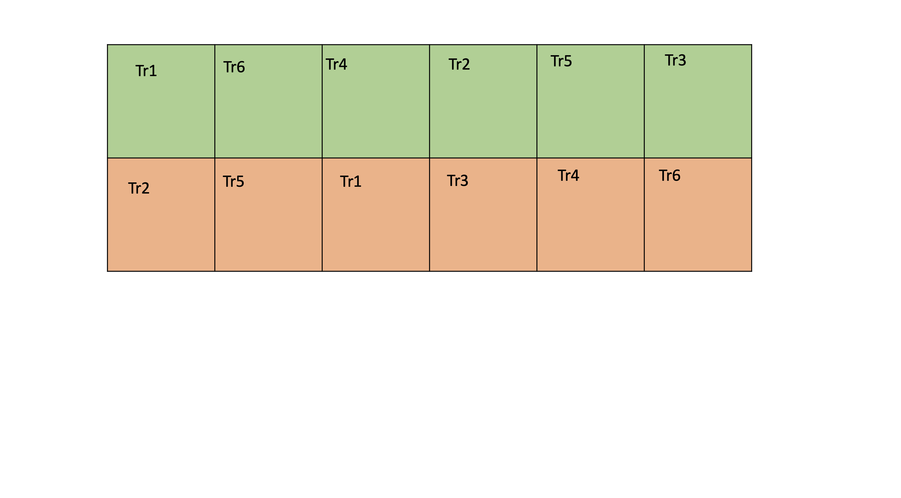

```{r xaringan-themer, include=FALSE, warning=FALSE}
library(xaringanthemer)
style_duo_accent(
  primary_color = "#081d58",
  secondary_color = "#FF961C",
 inverse_header_color = "#FFFFFF",
 title_slide_text_color = "#edf8b1",
 link_color =  "#41b6c4"
)
#style_solarized_light(text_font_google   = google_font("Josefin Sans", "400", "400i", "800i", "800"))
#style_mono_light(
#  base_color = "#1c5253",
#  header_font_google = google_font("Josefin Sans"),
#  text_font_google   = google_font("Josefin Sans", "400", "400i", "800i", "800"),
#  code_font_google   = google_font("Fira Mono")
#)
```

<style>

.center2 {
  margin: 0;
  position: absolute;
  top: 50%;
  left: 50%;
  -ms-transform: translate(-50%, -50%);
  transform: translate(-50%, -50%);
}

</style>

<style type="text/css">
.remark-slide-content {
    font-size: 30px;
}
</style>
```{r setup, include=FALSE}
options(htmltools.dir.version = FALSE)
```


## General model of a process or system 

(Adapted from Montgomery, 2013)

---
background-image: url('process.png')
background-position: center
background-size: contain


---
background-image: url('input.png')
background-position: center
background-size: contain

---
background-image: url('input2.png')
background-position: center
background-size: contain

---

## Nuisance factors


- Nuisance factors are those that may affect the measured result, but are not of primary interest.


---

## **Statistical** design of experiments

The process of planning the experiment so that appropriate data that can be analyzed by statistical methods will be collected, resulting in valid and objective conclusions.

--

Two aspects of any experimental problem

1. The design of the experiment

2. The statistical analysis of data


---

## Basic principles of experimental design

- Replication

- Randomization

- Blocking


---

## Replication

Repetition of the same experiment

## Replicate

Each repition of the experiment is called **replication**.

Example:

A coconut farmer puts two fertilizers (A and B) to 18 plants and each fertilizer is given to nine plants. Then he has 9 replicated from each type of fertilizer.

---

## In-class 

.pull-left[

$y_A$ vs $y_b$


]

.pull-right[

$\bar{y}_A$ vs $\bar{y}_b$

]

---

## Replication (cont.)

1. Estimate experimental error. This is the primary unit of measurement for determining whether observed differences in the data are statistically significant.

2. If the sample mean ( $\bar{Y}$ ) is used to estimate the effect of factors, replication allows the experimenter to obtain a more **precise** estimate of the effect.


(When the standard error is small, sample estimates are more precise; when the standard error is large, sample estimates are less precise.)

---

## Accuracy vs Precision


---

**Distrinction between Replication and Repeated measurements**


Replication: entire experiment is performed more than once for a given set of independent variables. 

Repeated measurements: multiple measurements from the same experimental unit

--

**Example 1: Crystal Growth Experiment**

Independent Variable:  temperature of solutions (degrees fahrenheit)

Response variable: Crystal volume is measured three times.

--

In this case the observed variability in the three repeated measurements is a direct reflection of the inherent variability in the measurement instrument. 

---

## Your turn: Replication or not?

**Example 2: Crystal Growth Experiment**

Independent Variable:  temperature of solutions (degrees fahrenheit)

Response variable: Crystal volume is measured three times.

Four crystals are processed simultaneously form an substance and measurement is taken from each crystal.


```{r, echo=FALSE}
library(countdown)
countdown(minutes = 2L, seconds = 00)
```

---

## Randomization

- both the allocation of **experimental material** and the **order in which the individual runs or trials of the experiment are to be performed** are randomly determined.

- helps to average out the effects of extraneous factors that may be present.


---

## Example

Question: Is one fertilizer better than another, in terms of yield?

Outcome variable: Tomato yield.

Factor of interest: Fertilizer type, A or B. One factor having two levels.

Experimental material: One plot of land to be divided into 2 rows of 6
subplots each.

Potential sources of variation: Fertilizer, soil, sun, water, humidity, etc.

---

## How should we assign treatments to the plots?


Experimental units will be randomly assigned to treatments by using lottery method.


---
background-image: url('crd1.png')
background-position: center
background-size: contain

---
background-image: url('crd2.png')
background-position: center
background-size: contain

---
background-image: url('crd3.png')
background-position: center
background-size: contain

---
background-image: url('crd4.png')
background-position: center
background-size: contain

---

## Blocking

- Blocking is a technique for dealing with controllable nuisance factors.

- A nuisance factor has some effect on the response, but it is of no interest to the experimenter. However, the variability it transmits to the response needs to be minimized.

- Randomization within blocks of homogeneous experimental units (Blocks are usually homogeneous and treatments will be randomly assigned within each block).

- Every block contains each of the treatment.

- Variability between blocks can be large, variability within a block should be relatively small.


---

# Example

- RCBD with 6 treatments each with 2 replications and 2 blocks

- Every block contains each of the treatment.



Every block contains each of the treatment.


---

background-image: url('tea.jpeg')
background-position: center
background-size: cover

## Example: Blocking

---

## Example: Blocking

Hypothesis: Tea varieties (A versus B) affects tea yield

Experimental units: three plots of land, each to be divided into a $2 \times 2$ grid

Outcome: Tea yield

Factor of interest: Tea varieties, A or B

Nuisance factor : Soil quality

---

# Design types

- Complete Randomized Design (CRD)

- Randomized Complete Block Design (RCBD)

- Latin Square Design

- Factorial Designs

---
class: center, middle, inverse

# **Complete Randomized Design (CRD)**

---

## Complete Randomized Design (CRD)

- The most basic type of statistical design

- Particularly useful when the experimental units are homogeneous

- Every experimental unit has an equal chance to receive any one of the treatments


---


## Example 1

Question: How the 4 diets (A, B, C, and D) affect the coagulation of rabbits? 

Treatment: Diet

Factor levels: A, B, C, D

Response: Time in seconds that it takes for a cut to stop bleeding (coagulation rate).

Experimental unit: 16 rabits

Replicates: 4


There are 16 rabbits (same age, weight, height) 

---
background-image: url('bunnies.jpeg')
background-position: center
background-size: cover

## Your turn

<span style="color: white;">How should we use randomization to assign rabbits to four treatment group?</span>


```{r, echo=FALSE}
library(countdown)
countdown(minutes = 5L, seconds = 00)
```


---

## In-class 

---
background-image: url('packagefood.jpeg')
background-position: center
background-size: cover

# Example 2


---

# Example 2

A food company wished to test four different package designs for a new breakfast cereal. Ten stores, with approximately equal sales volumes, were selected as the experimental units. Each store was randomly assigned one of the package designs, with two of the package designs assigned to 3 stores each and other two designs to two stors each. Other relevant conditions besides package design, price, amount and location of shelf space and special promotional efforts were kept the same for all stores in the experiment. Sales, in number of cases, were observed for the study period. 

---
background-image: url('sales.png')
background-position: center
background-size: cover


