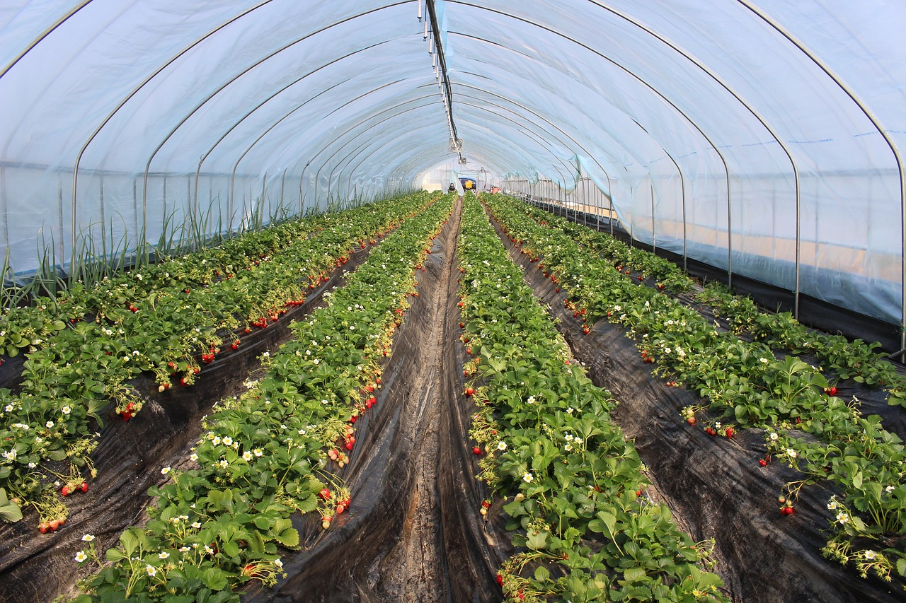

```{r xaringan-themer, include=FALSE, warning=FALSE}
library(xaringanthemer)
style_duo_accent(
  primary_color = "#081d58",
  secondary_color = "#FF961C",
 inverse_header_color = "#FFFFFF",
 title_slide_text_color = "#edf8b1",
 link_color =  "#41b6c4"
)
#style_solarized_light(text_font_google   = google_font("Josefin Sans", "400", "400i", "800i", "800"))
#style_mono_light(
#  base_color = "#1c5253",
#  header_font_google = google_font("Josefin Sans"),
#  text_font_google   = google_font("Josefin Sans", "400", "400i", "800i", "800"),
#  code_font_google   = google_font("Fira Mono")
#)
```

<style>

.center2 {
  margin: 0;
  position: absolute;
  top: 50%;
  left: 50%;
  -ms-transform: translate(-50%, -50%);
  transform: translate(-50%, -50%);
}

</style>

<style type="text/css">
.remark-slide-content {
    font-size: 27px;
}
</style>
```{r setup, include=FALSE}
options(htmltools.dir.version = FALSE)
```


# Completely randomized design

## Advantages of CRD

- Easy to design

- Analysis of data is simple and straight forward

- Even if some values are missing the analysis can be done

## Disadvantages of CRD

- The design requires homogeneous set of experimental units

- If the experimental units are not homogeneous, error component will be large and this will make the treatment comparison less efficient.

---

# Randomized Complete Block Design (RCBD)


- Suppose we want to compare $r$ treatments

- To run a CRD, we need to find $n_1 + n_2 + .... + n_r$ **homogeneous** experimental units to apply treatment.

- Often it is difficult to find enough experimental homomogeneous units.

- However, it may be possible to find **several blocks of experimental units, with enough homogeneous experimental units** to apply $r$ treatments.

- RCBD can be used to compare treatment means in such situations even though there are differences between blocks.

---

## Nuisance factor

A factor that has an effect on the response, but we are not interested in that effect.


- **Unknown and uncontrollable: ** *Randomization* to balance out its effect 


- **Known and uncontrollable but measurable:** *Analysis of covariance (ANCOVA)*  (at the time of the analysis)

- Nuisance source of variability is **Known and controllable**: use *Blocking* to systematically eliminate its effect on the statistical comparison among treatment means.

---

## Example

We want to test the difference between different fertilizers (A, B, C, D, E, F) on strawberry yield. The experimenter has decided to obtain four observations for each fertilizer type.

--
How many experimental units are required to compare the treatments?

---



---

## Example (cont.)

The experiment is run at 4 different locations having 6 different plots of land each. Hence, a block is given by a location and an experimental unit by a plot of land.

---

## Example (cont.)

- randomized complete block design (RCBD) 

- the experimental units are homogeneous within a block

- within each block, the 6 treatments are randomly assigned to 6 experimental units

- each block (farms) contains all the treatments (fertilizer)

- the design is called **complete** because we see the complete set of treatments within every block 


---

## RCBD

In-class diagram


---

## RCBD

### Randomization:

- Number the $a$  treatments $1,2,…,a$.

- First form the homogeneous blocks of the experimental units. Then allocate each treatment randomly in each block. 

    - Number the units in each block as $1, 2,...,a$.
    - Randomly allocate the $a$ treatments to $a$ experimental units in each block


---
## RCBD

### Replication

Since each block contains all the treatments, so every treatment will appear in all the blocks. So each
treatment can be considered as if replicated the number of times as the number of blocks. Hence, in RCBD, the
number of blocks and the number of replications are same.


---


## Your turn


Question: How the 4 diets (A, B, C, and D) affect the coagulation of rabbits? 

Treatment: Diet

Factor levels: A, B, C, D

Response: Time in seconds that it takes for a cut to stop bleeding (coagulation rate).

Experimental unit: 16 rabits

Replicates: 4


There are 16 rabbits (same age, weight, height) 

---
background-image: url('bunnies.jpeg')
background-position: center
background-size: cover

## Your turn

<span style="color: white;">Which approach do you use to analyze the data? CRD or RCBD</span>


---

Have a jar with the letters A, B, C, D written on separate slips. Catch a rabbit, pick a slip at random from the bowl and assign the rabbit to the diet letter on the slip. Do not replace the slip. Catch the second rabbit and select another slip from the remaining three slips. Assign that treatment to the second rabbit. Continue until the first four rabbits are assigned one of the four diets. Replace the slips and repeat the procedure until all rabbits are assigned to a diet. 

#### Which approach do you use to analyze the data? CRD or RCBD

source: [here](http://www.worldcolleges.info/sites/default/files/enggnotes/completely_randomized_design.pdf)

---

## Notations

|  Block 1 	|  Block 2	|  ...	| Block b 	| 
|:---:	| :-----:	| :---:	| :---:	| 
| $y_{11}$ 	|  $y_{12}$	|  ...	| $y_{1b}$	|  
| $y_{21}$ 	| $y_{22}$ 	| ... 	| $y_{2b}$ 	| 
|  .	|  	|  	|  	|  
|  .	|  	|  	|  	|  
|  .	|  	|  	|  	| 
| $y_{a1}$ 	| $y_{a2}$ 	|  ...	| $y_{ab}$ 	| 


Number of treatments: $a$

Number of blocks: $b$

---

"There is one observation per treatment in each block, and the order in which the treatments are run within each block is determined randomly. Because the only, randomization of treatment is within the blocks, we often say that the blocks represent **a restriction on randomization**". (Montgomery, Design and Analysis of Experiments, 2001)


---

## Statistical Model for the RCBD


**1. Mean model**

$$Y_{ij}= \mu_{ij} + \epsilon_{ij}
\begin{cases}
     i=1, 2, ..., a \\
    j=1, 2, ..., b           
\end{cases}$$


$a$ - number of treatments

$b$ - number of blocks

$\mu_{ij}$ - mean of the $i$th factor level or treatment and $j$th block

$\epsilon_{ij}$ - random error  (It is assumed $\epsilon_{ij}$'s are independent and $N(0, \sigma^2)$)


---

Let

$\mu$ - overall mean,

$\tau_i$ - effect of the $i$th treatment,

$\beta_j$ - effect of the $j$th block,


Then, $\mu_{ij} = \mu + \tau_i + \beta_j$.

---

## Statistical Model for the RCBD


**2. Effects model**


$$Y_{ij}= \mu + \tau_i + \beta_j + \epsilon_{ij}
\begin{cases}
     i=1, 2, ..., a \\
    j=1, 2, ..., b           
\end{cases}$$


.pull-left[

$a$ - number of treatments

$b$ - number of blocks

$\mu$ - overall mean

]

.pull-right[

$\tau_i$ - effect of the $i$th treatment

$\beta_j$ - effect of the $j$th block

$\epsilon_{ij}$ - random error with $NID(0, \sigma^2)$

]


---

## Two constraints

Treatment effect and block effects are the deviations from the overall mean. Hence

$$\sum_{i=1}^a\tau_i=0$$
and

$$\sum_{j=1}^b\beta_j = 0$$


---
## In-class

In CRD

$$Y_{ij}= \mu + \tau_i + \epsilon_{ij}
\begin{cases}
     i=1, 2, ..., a \\
    j=1, 2, ..., n           
\end{cases}$$


$$\tau_i = \mu + \mu_i, \text{ } i=1, 2, ...a$$

$$\frac{\sum_{i=1}^a \mu_i}{a} = \mu$$

This definition implies

$$\sum_{i=1}^a\tau_i = 0$$
---

# In-class


---
class: center, middle

## Hypothesis - RCBD

---

We want to test the **equality of the treatment means**

$$H_0: \mu_1 = \mu_2 = ... = \mu_a$$
$$H_1: \text{at least one }\mu_i \neq \mu_j$$

The $i$th treatment mean can be written as

$$\mu_i = \frac{\sum_{j=1}^b(\mu + \tau_i + \beta_j)}{b} = \mu + \tau_i.$$
Hence, an equivalent way of writing the above hypothesis

$$H_0: \tau_1 = \tau_2 = ... = \tau_a = 0$$
$$H_1: \tau_i \neq 0\text{ at least one } i$$

---

# Notations

$y_{i.}$ - total of all observations taken under treatment $i$

> *Write the mathematical equation*

$y_{.j}$ - total of all observations in block $j$

> *Write the mathematical  equation*

$y_{..}$ - the grand total of all observations

> *Write the  mathematical  equation*

$N=ab$ be the total number of observations

---

## Notations

$\bar{y}_{i.}$ - the average of the observations taken under treatment $i$


$\bar{y}_{.j}$ - the average of the observations in block $j$


$\bar{y}_{..}$ - the grand average of all observations

$$\bar{y}_{i.} = \frac{y_{i.}}{b}$$

$$\bar{y}_{.j} = \frac{y_{.j}}{a}$$

$$\bar{y}_{..} = \frac{y_{..}}{N}$$

---

We express the total corrected sum of squares 


$$\sum_{i=1}^a\sum_{j=1}^b (y_{ij} - \bar{y}_{..})^2 = \sum_{i=1}^a\sum_{j=1}^b[(\bar{y}_{i.} - \bar{y}_{..}) + (\bar{y}_{.j} - \bar{y}_{..}) + (y_{ij} - \bar{y}_{i.} - \bar{y}_{.j} + \bar{y}_{..})]^2$$


Note: 

- The **sum of squares** is the **sum of the squared values of a variable**. 

- For example the total corrected sum of squares is the sum of the squared values after subtracting (i.e. correcting for) their mean.


---

## Your turn

$$\sum_{i=1}^a\sum_{j=1}^b (y_{ij} - \bar{y}_{..})^2 = \sum_{i=1}^a\sum_{j=1}^b[(\bar{y}_{i.} - \bar{y}_{..}) + (\bar{y}_{.j} - \bar{y}_{..}) + (y_{ij} - \bar{y}_{i.} - \bar{y}_{.j} + \bar{y}_{..})]^2$$

Show that the above can be simplified into


$$\sum_{i=1}^a\sum_{j=1}^b (y_{ij} - \bar{y}_{..})^2 = b\sum_{i=1}^a(\bar{y}_{i.} - \bar{y}_{..})^2 + a\sum_{j=1}^b(\bar{y}_{.j} - \bar{y}_{..})^2 + \\ \sum_{i=1}^a\sum_{j=1}^b (y_{ij} - \bar{y}_{.j} - \bar{y}_{i.} + 
\bar{y}_{..})$$


$$SS_T = SS_{Treatment} + SS_{Block} + SS_{E}$$


---

## ANOVA Table

Source of variation |  Sum of squares (SS) | DF| Mean Square (MS) | F| p-value |
---:---:---:---:---:---|
Treatments |  $SS_{Treatments}$ | $a-1$ | $MS_{Treatments}$ | $F_0=\frac{MS_{Treatments}}{MS_E}$ | $P(F \geq F_0)$|
Blocks |  $SS_{Blocks}$ | $b-1$ | $MS_{Blocks}$ |  | |
Error  | $SS_E$ | $(a-1)(b-1)$ | $MS_{E}$ | |
Total |  $SS_T$ | $N-1$| | | |

---

### Example

Section 4.1, Montgomery, D. C. (2017). Design and analysis of experiments. John wiley & sons.

Experiment: Hardness testing experiment

- We wish to determine whether 4 different tips produce
different (mean) hardness reading on a hardness tester.

- A hardness testing machine operates by pressing a tip into a metal test
“coupon.” 

- The hardness of the coupon is measured from the depth of the
resulting depression. - **Response variable**

- Four tip types are being tested to see if they produce
significantly different readings. - **Treatment**

---

### Example (cont.)


- The coupons might differ slightly in their
hardness (for example, if they are taken from ingots produced in different heats). - **Block**

- Within each coupon (block) the order in which the
four tips were tested was randomly determined.


References: https://web.ma.utexas.edu/users/mks/384Esp08/rcbdexample.pdf

---

### Example (cont.)

```{r, comment=NA}
tip <- c(1, 2, 3, 4)
coupon1 <- c(9.3, 9.4, 9.2, 9.7)
coupon2 <- c(9.4, 9.3, 9.4, 9.6)
coupon3 <- c(9.6, 9.8, 9.5, 10.0)
coupon4 <- c(10.0, 9.9, 9.7, 10.2)
df <- data.frame(tip=tip, coupon1=coupon1, coupon2=coupon2, coupon3=coupon3, coupon4=coupon4)
df
```

---

```{r, comment=NA}
summary(df[, 2:5])
```

---

```{r, message=FALSE, warning=FALSE, comment=NA}
library(tidyverse)
df.pl <- df %>% pivot_longer(2:5, "Block", "value")
df.pl
```


---

```{r, message=FALSE, warning=FALSE, comment=NA}
library(tidyverse)
df.pl$tip <- as.factor(df.pl$tip)
df.block <- df.pl %>% group_by(Block) %>% summarize(mean = mean(value))
df.block
df.treatment <- df.pl %>% group_by(tip) %>% summarize(mean = mean(value))
df.treatment
```

---


## Block

.pull-left[

```{r, comment=NA, echo=FALSE}
ggplot(data=df.pl, aes(x=Block, y=value, col=Block)) +  geom_point(size=3) +
#  geom_crossbar(data=df.block, aes(ymin=mean, ymax=mean), size=1, col="red", width = .5) + 
  scale_color_manual(values=c("#1b9e77", "#d95f02", "#7570b3", "#e7298a"))  
```

]

.pull-right[

```{r, comment=NA, echo=FALSE}
ggplot(data=df.pl, aes(x=Block, y=value, col=Block)) + geom_boxplot(aes(fill=Block), alpha=0.5) +   geom_point(size=3, colour="black", alpha=0.5) + scale_color_manual(values=c("#1b9e77", "#d95f02", "#7570b3", "#e7298a")) +  scale_fill_manual(values=c("#1b9e77", "#d95f02", "#7570b3", "#e7298a")) 
```

]


---


## Treatment

.pull-left[

```{r, comment=NA, echo=FALSE}

ggplot(data=df.pl, aes(x=tip, y=value, col=tip)) +  geom_point(size=3) + scale_color_manual(values=c("#1b9e77", "#d95f02", "#7570b3", "#e7298a")) 
```

]

.pull-right[

```{r, comment=NA, echo=FALSE}
ggplot(data=df.pl, aes(x=tip, y=value, col=tip)) + geom_boxplot(aes(fill=tip), alpha=0.5) +   geom_point(size=3, colour="black", alpha=0.5) + scale_color_manual(values=c("#1b9e77", "#d95f02", "#7570b3", "#e7298a")) +  scale_fill_manual(values=c("#1b9e77", "#d95f02", "#7570b3", "#e7298a")) 
```

]

---

## ANOVA

```{r, comment=NA, message=FALSE}

two.way <- aov(value~ tip + Block, data = df.pl)
summary(two.way)
```

---

# Acknowledgement

Some of the slide content is based on

Montgomery, D. C. (2017). Design and analysis of experiments. John wiley & sons.


